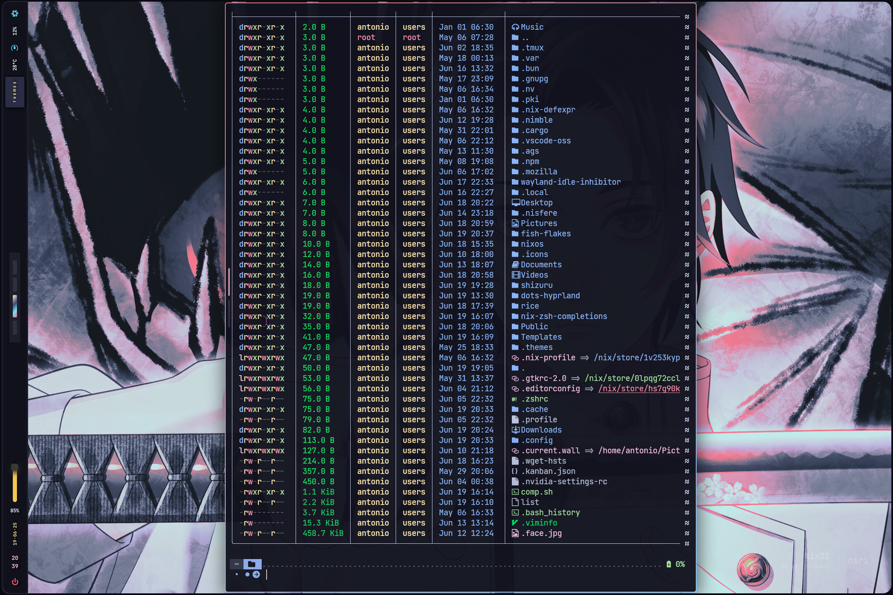
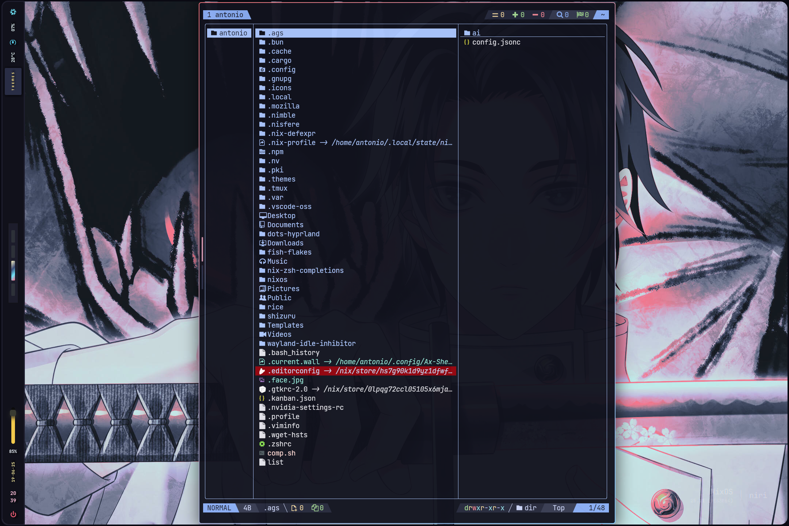

# My fish Configuration for nixos (provided as flake module) this is my learning purpose and personal use but if you want to use yes you can!!!But your system need to be handle with hjem and hjem-rum if you want to know how to configure
# check this repo host/shizuru/hjem.nix || [`hjem.nix`](https://github.com/maotseantonio/shizuru/blob/main/hosts/shizuru/hjem.nix)

# On this time fish_variable will need to manually add because nix symlink cannt handle global variables. The fish_variable also contain in this repo 

### 🖼️ Gallery for my fish 

<p align="center">
    <br>
    <br>
    Screenshots last updated <b>2025-6-19</b>
</p>

Add to `inputs` in `flake.nix`:

```nix
fish-flake.url = "github:maotseantonio/fish-flakes";
```
Usage with a minimal system flake:

```nix

{
    nixosConfigurations = {
      shizuru = nixpkgs.lib.nixosSystem {
        specialArgs = {
          inherit system inputs username host chaotic pkgs-master;
        };
        modules = [
          ./hosts/${host}/config.nix
          inputs.chaotic.nixosModules.default
          inputs.fish-flake.nixosModules.myfish
         ]
     };

  }
```

