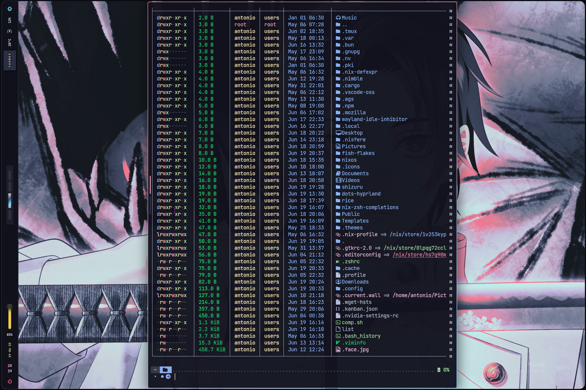
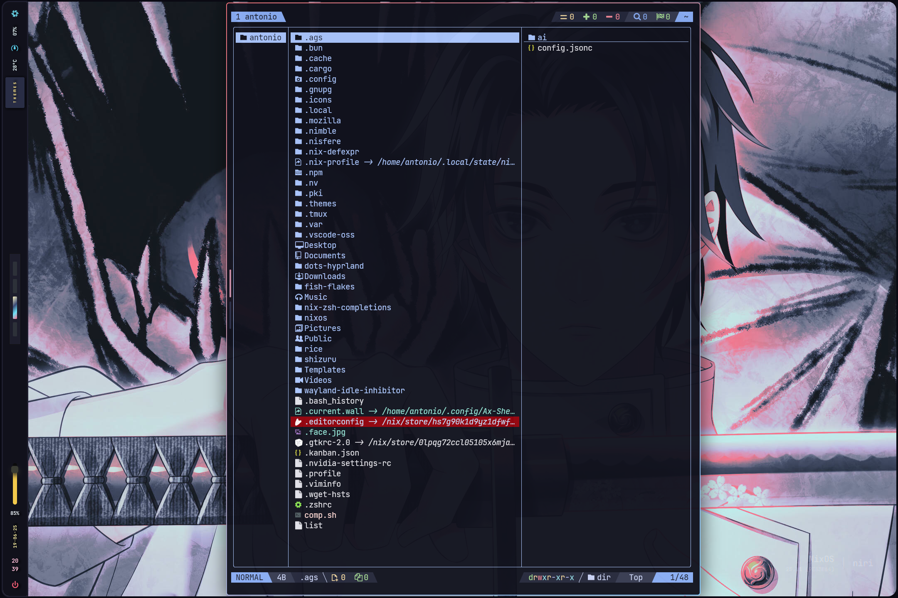

<div align="center"></div>
<h1 align="center">Useless Fish Config Flake</h1>
## ✨ Features

- ❄️ Flakes - for precise dependency management of the entire fish config.
- 🏡 defaultshell - options for default shell.
- 🏡 mainUser - main user option default is my username("antonio").
- 🏡 hjem - to configure symlink to user directory.
- 💽 hjem-rum - only for flex.
- ⚠️ zoxide - for interactive and useful cd 
- 💈 Theme - Catppuccin Mocha.
- 🍎 atuin - for history search.
- 🔐 eza - more beautiful replacement for ls.
- 🤖 lsd - eza replacement.
- ⚡ g-ls - for nushell style ls comment.
- 💭 bat - cat replacement.
- 🔥 starship - powerful prompt.
- 🎁 FZF - for some terminal work.
- 📁 Config file structure and modules with options.

### 🖼️ Gallery for my fish 

<p align="center">
    <br>
    <br>
    Screenshots last updated <b>2025-6-19</b>
</p>

Add to `inputs` in `flake.nix`:

```nix
fish-flake.url = "github:maotseantonio/fish-flakes";
```
Usage with a minimal system flake:

```nix

{
    nixosConfigurations = {
      shizuru = nixpkgs.lib.nixosSystem {
        specialArgs = {
          inherit system inputs username host chaotic pkgs-master;
        };
        modules = [
          ./hosts/${host}/config.nix
          inputs.chaotic.nixosModules.default
          inputs.fish-flake.nixosModules.myfish
         ]
     };

  }
```

In your `host.nix` or `config.nix` add this 

```nix

{
   
  rum.programs.fish = {
      enable = true;
      defaultShell = true;
      mainUser = "username"; #default is antonio
      wrapperPackages = [ pkgs.tldr pkgs.lazygit ];
      plugins = [
        "jorgebucaran/fisher"
        "patrickf3139/fzf.fish"
       ];
    };

  }
```


